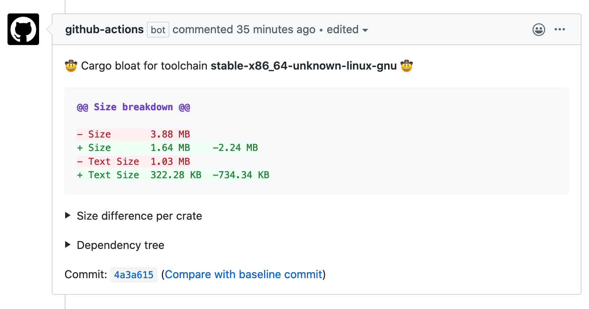
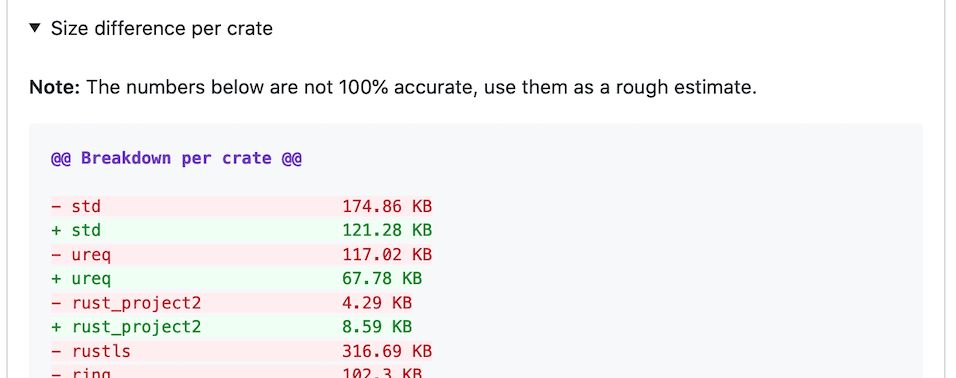
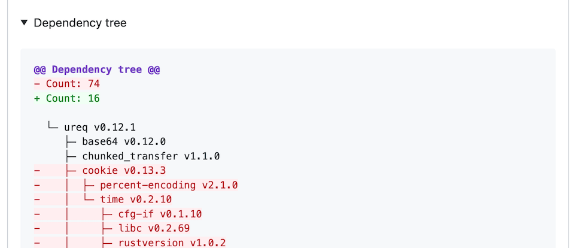

# Cargo Bloat Action :rocket:

Analyse and track your Rust project binary size over time. This action runs on every pull request and gives you a breakdown of
your total binary size, how much each crate contributes to that size and a list of changes to your dependency tree.

**Table of Contents**

* [Example workflow](#example-workflow)
* [Screenshots](#screenshots)
* [Why?](#why)
* [Contribute](#contribute)

## Example Workflow

Check out [cargo-bloat-example](https://github.com/orf/cargo-bloat-example/) for a full example project. For an example pull request,
see https://github.com/orf/cargo-bloat-example/pull/1.

```yaml
on: # rebuild any PRs and main branch changes
  pull_request:
  push:
    branches:
      - master

name: bloat

jobs:
  cargo_bloat:
    runs-on: ubuntu-latest
    steps:
      - uses: actions/checkout@master
      - name: Install Rust
        uses: actions-rs/toolchain@v1
        with:
          toolchain: stable
      - name: Run cargo bloat
        uses: orf/cargo-bloat-action@v1
        with:
          token: ${{ secrets.GITHUB_TOKEN }}
```

## Options

* `by_function` - Display per-function bloat instead of per-crate bloat
* `bloat_args` - Custom arguments to pass to `cargo bloat`
* `tree_args` - Custom arguments to pass to `cargo tree`
* `exclude_packages` - packages to exclude from running `cargo bloat` on (useful for projects unsupported by cargo bloat such as static libraries).

## Screenshots

### Total size change



### Size difference per crate



### Changes in your dependency tree (`cargo tree`)



## Why?

I think it's important to track the size of your dependencies. It's not the most important thing, but I think these metrics belong in a
pull request that modifies dependencies in order to have a full picture of the impact the change makes and to make an informed decision
before merging.

## Contribute

All contributions are welcome!
